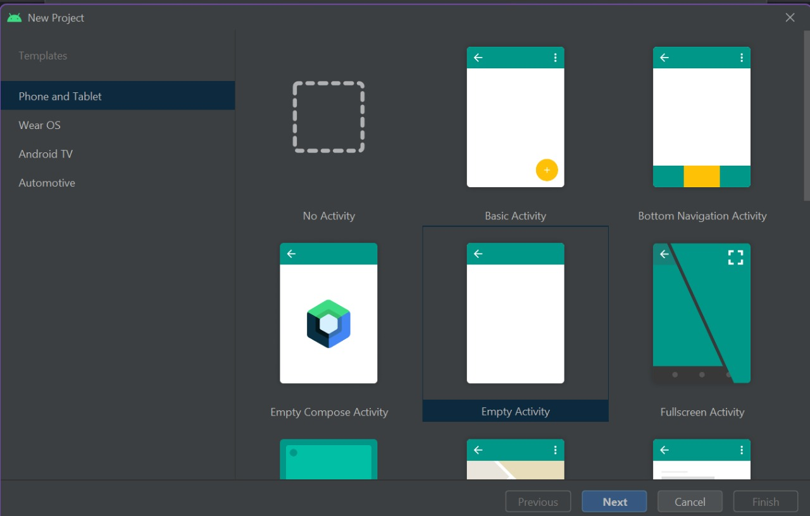

# LAPORAN PRAKTIKUM RECYCLERVIEW
NAMA: SHINE DEVI OKTAVIANA R S P  
KELAS: TI 3C  
NIM: 2041720065
## 1. MEMILIH EMPTY ACTIVITY

## 2. MENGATUR DEPENDENCIES

## 3. MENAMBAHKAN ELEMEN RECYCLERVIEW PADA LAYOUT ACTIVITY

## 4. MEMBUAT CLASS MODEL ITEM UNTUK MEREPESENTASIKAN ITEM

## 5. MEMBUAT LAYOUT BARU BERTIPE CARDVIEW

## 6. MEMBUAT ADAPTER

## 7. MEMBUAT DATA HOLDER

## 8. MEMBUAT DATA

## 9. IMPLEMENTASI KE MAIN ACTIVITY

## 10. HASIL

